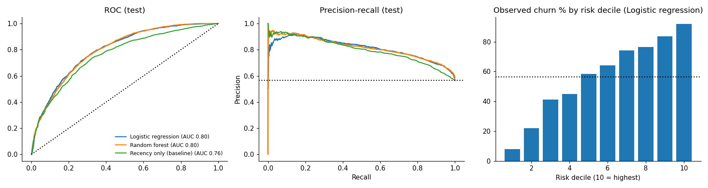
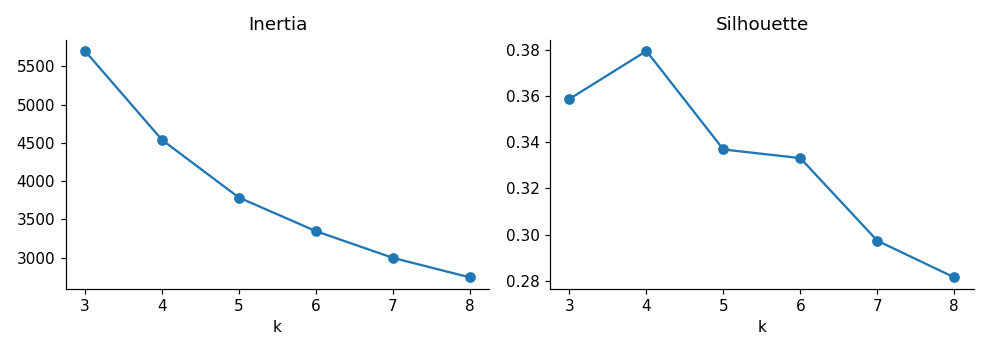
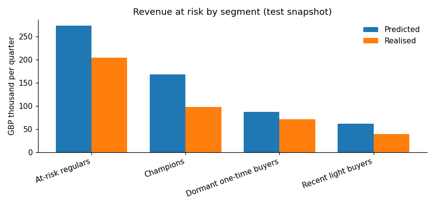

# Customer Segmentation & Churn Risk (RFM, SQL, K-Means and ML)



A reproducible business analytics case study using **UCI Online Retail II**, an anonymised historical **UK** retailer dataset. Objective: segment customers by purchasing patterns, predict who may not purchase in the next 90 days, and estimate exposure using a transparent trailing-revenue proxy. All results below were **independently re-executed 2 October 2026** using the original supplied data workbook (the source Excel is omitted from this browser-upload edition because of GitHub web-upload size limits). This is a recovery of Claude's subsequently rebuilt notebook; it is not the user's unrecovered earlier hypothetical project.

## Business questions and methodology

1. **Who buys?** Clean raw sales lines; remove exact duplicates, missing customer IDs, cancellations and service stock codes. Keep returns separate. Build recency, frequency and monetary (RFM) data in both pandas and SQLite SQL and compare them.
2. **What kinds of customers?** Transform and standardise log-RFM, choose K-Means cluster count using silhouette across k=3–8, then assign human-readable profile-based segment names. The future churn label is NOT used to cluster.
3. **Who might stop buying?** Churn means **no further purchase over the next 90 days**. Features at each snapshot use only earlier invoices. Train on snapshots 2010-12-12 and 2011-03-13, select a model using 2011-06-11 validation, then refit using all three past snapshots and test on **2011-09-09**. Compare logistic regression and random forest against recency-only ranking.
4. **What might be at risk?** For each customer, estimate next-quarter value from trailing 365-day revenue × 90/365, then multiply by estimated churn probability. Comparing with observed churners' *proxy values* is NOT comparing with actual confirmed lost revenue.

## Verified results

- **1,067,371** raw transaction lines; **776,577** cleaned sales lines, **5,852** distinct sales customers. At the test snapshot, **5,256** historical customers were available, with an observed **56.5%** 90-day inactivity rate.
- SQL and pandas RFM matched for **all 5,256** customers. Silhouette chose **four segments** (silhouette **0.380**).
- **Champions**: 871 customers (**16.6%**) accounted for **67.3%** of cumulative pre-snapshot spend. Other segments: at-risk regulars 1,607; dormant one-time buyers 2,131; recent light buyers 647.
- Earlier validation selected **logistic regression** (validation AUC 0.818; random forest 0.815). On the later test snapshot: logistic regression **AUC 0.798**, random forest **0.797**, recency-only ranking **0.762**. Logistic regression's top 20% risk group captured **31.1%** of observed churners and had **87.8%** precision within that group.
- Modelled revenue at risk totalled about **£589k**, compared with approximately **£413k** in historical-revenue proxy value among customers observed to be inactive in the subsequent window. These are *scenario-based proxy calculations*, **not actual realised revenue loss or measured future sales**.





## Reproduce

```bash
python -m pip install -r requirements.txt
cd notebooks
jupyter nbconvert --to notebook --execute analysis.ipynb --output analysis_EXECUTED.ipynb --ExecutePreprocessor.timeout=1800
```

The notebook reads `../data/online_retail_II.xlsx` and creates charts and tables in `../images/` and `../outputs/`. Start from the repository root and ensure `images/` and `outputs/` exist. `notebooks/analysis_EXECUTED.ipynb` already contains the verified run. Reading the large Excel workbook can take several minutes.

## Repository contents

- `data/online_retail_II.xlsx`: **download separately from UCI** at https://archive.ics.uci.edu/dataset/502/online+retail+ii and place here unchanged (not included in the smaller GitHub browser-upload edition); `data/SOURCE.md` gives attribution and licensing.
- `notebooks/analysis.ipynb`: recovered source notebook; `notebooks/analysis_EXECUTED.ipynb`: independently executed notebook with outputs; `notebooks/build_notebook.py`: recovered notebook builder.
- `images/`: k-selection, model evaluation, random-forest importance and revenue-risk charts.
- `outputs/`: aggregated cleaning log, segment profiles, model metrics, risk estimates and run config. Customer-level risk scores are omitted from this public edition.
- `sql_rfm.sql`: SQL equivalent of core RFM features.
- `RECOVERY_NOTES.md`: detailed provenance and limitations.

## Important limitations

This is historical **UK** retail, not representative of Australian customers. Churn is a *chosen* 90-day inactivity window and is not actual account termination. Prior snapshots can contain the same customers; temporal testing reduces but does not remove all potential deployment shift. The chosen validation metric was AUC. K-Means segment names depend on cluster profiles. The revenue-at-risk proxy does **not** estimate actual incremental revenue recoverable through an intervention. Future business decisions need prospective validation, calibration checks and experimental uplift measurement.

## Data citation

Daqing Chen, *Online Retail II*, UCI Machine Learning Repository, DOI: https://doi.org/10.24432/C5CG6D (CC BY 4.0).
